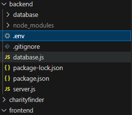

# Database Instructions

Name: Zach Coomer

Date: 11/3/2024

## Required
* MySQL Installation
    - [MySQL Community Installer for Windows](https://dev.mysql.com/downloads/installer/).
    - Youtube [tutorial](https://www.youtube.com/watch?v=oPV2sjMG53U&t=409s) for installing MySQL on Windows and another [tutorial](https://www.youtube.com/watch?v=wgRwITQHszU).
    - **Note: MySQL Workbench is not required but is recommended.

* Database Scripts
    - These are included in the directory, use the most current(which will be noted in the file name).
    - These are used to create the database and tables used for CharityFinder.

* Configuration File
    - This is in the form of `.env` and must be included in the `backend` directory. <br/> Example: <br/>  
    - The format of the variables in the .env files is as follows:  
        ```properties
        MYSQL_HOST='your host address'     //typically 127.0.0.1
        MYSQL_USER='root'                  //typically root
        MYSQL_PASSWORD='your_password'     //the password you used when setting up the mysql server
        MYSQL_DATABASE='charity_finder_db' //this is already specified for the database, so do not change it.
        ```

## Instructions
Once you have all of the required files and programs installed from above, you can use the database script to create the charity_finder_db. Once the database is created you will be able to test the features with your version of the database running on your machine.

## Notes
* You can manually add to the database using the MySQL Workbench or by using MySQL in the command line if you have the Environment Variables set up properly to the MySQL Server bin folder. I recommend just using the MySQL Workbench.